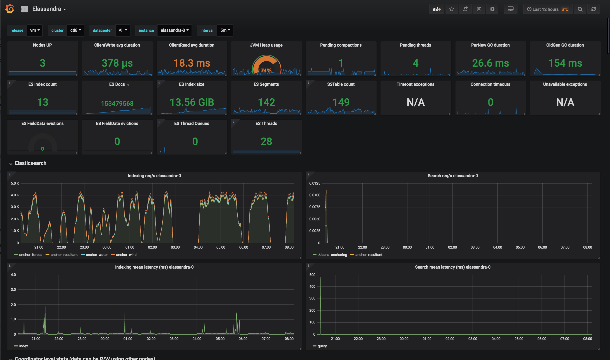

# Elassandra Grafana Dashboard

This repo provides Grafana dashboards for [Elassandra Enterprise](http://doc.elassandra.io/en/latest/enterprise.html) running under Kubernetes and monitored through the [Prometheus Operator](https://github.com/coreos/prometheus-operator)



## Export JMX metrics

To expose both Cassandra and Elasticsearch JMX metrics, set **jmx.enabled** to **true** in your /etc/cassandra/elasticsearch.yml configuration file (enabled by default), or set the environment variable ELASTICSEARCH__jmx_enabled="true".

Enable the JMX exporter by settings the following environment variables:
* CASSANDRA_JMX_PROMETHEUS_EXPORTER_PORT="7500"
* CASSANDRA_JMX_PROMETHEUS_EXPORTER_CONF="/usr/share/cassandra/conf/jmx_prometheus_exporter.yml"
 
The JMX exporter configuration file /usr/share/cassandra/conf/jmx_prometheus_exporter.yml is included in the Elassandra Enterprise docker image.

Restart Elassandra nodes and check metrics are available:

```bash
kubectl exec -it elassandra-0 -- curl http://localhost:7500/metrics
``` 

## Add Kubernetes annotations

Add the following annotations to automatically scrap Elassandra PODs:

```yaml
annotations.prometheus.io/scrape: true 
annotations.prometheus.io/port: 7500 
```

## Add Kubernetes labels

Add the following kubernetes labels to Elassandra PODs:

```yaml
release: "my-release"
cluster: "my-cluster"
datacenter: "DC1"
```

If you deploy Elassandra through the HELM chart, the **release** label is automatically added to your Elassandra PODs.
 
## Configure Prometheus POD scraping

In your Prometheus Operator (in HELM values.yaml, prometheusSpec.additionalScrapeConfigs), add the following scrap config to properly map Kubernetes pod's labels to Grafana dashboard variables:

```yaml
prometheusSpec:
  additionalScrapeConfigs:
    - job_name: 'kubernetes-pods'
      kubernetes_sd_configs:
      - role: pod
      relabel_configs:
      - source_labels: [__meta_kubernetes_pod_annotation_prometheus_io_scrape]
        action: keep
        regex: true
      - source_labels: [__meta_kubernetes_pod_annotation_prometheus_io_path]
        action: replace
        target_label: __metrics_path__
        regex: (.+)
      - source_labels: [__address__, __meta_kubernetes_pod_annotation_prometheus_io_port]
        action: replace
        regex: ([^:]+)(?::\d+)?;(\d+)
        replacement: $1:$2
        target_label: __address__
      - action: labelmap
        regex: __meta_kubernetes_pod_label_(.+)
      - source_labels: [__meta_kubernetes_namespace]
        action: replace
        target_label: kubernetes_namespace
      - source_labels: [__meta_kubernetes_pod_name]
        action: replace
        target_label: kubernetes_pod_name
      - source_labels: [__meta_kubernetes_pod_name]
        action: replace
        target_label: instance
```

As the result, check that your Elassandra PODs have the expected tags in your Prometheus targets.

## Import the Elassandra dashboard

Upload the [Elassandra-kubernetes-dashborad.json](elassandra-kubernetes-dashboard.json) in your [Grafana import wizard](http://docs.grafana.org/features/export_import/#import).


